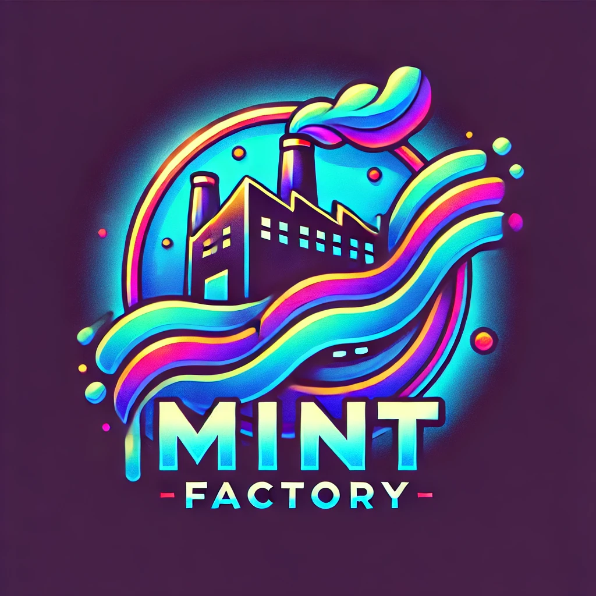

Mint Factory is a decentralized application (dApp) that allows anyone to create a NFT (Non-Fungible Token) that is minted directly to their wallet. The application also helps verify that a NFT is owned by a user. The NFTs are stored on the decentralized IPFS (InterPlanetary File System) via Pinata.

## Demo
<video src="assets/videos/local-demo.mov" controls="controls" style="max-width: 100%;">
  Your browser does not support the video tag.
</video>

## Pre-Requisites (Local)
- Free pinata account to create environment variables for a .env file listed below (also listed in the .env.example file):
  - PINATA_JWT
  - NEXT_PUBLIC_PINATA_GATEWAY_URL
  - PINATA_GATEWAY_URL
- Metamask Wallet browser extention
- Hardhat network setup on the Metamask wallet.

## Setup (Local)
- Run `npm install` to install all node dependencies.
- CD into the hardhat folder and run `npx hardhat node` in the command prompt to run the local hardhat blockchain node.
- Import as many hardhat node wallets you want to test the application with.
- Select the hardhat network on Metamask.
- Deploy the Mint Factory smart contract onto the hardhat local node by running the script in the hardhat folder with `npx hardhat run scripts/deploy.ts --network localhost`
- Run `npm run dev` to start the Next.js server.
- Go to [http://localhost:3000](http://localhost:3000) in your browser to load the application.
- Enjoy minting new NFT(s) in the Mint Factory!

## General Suggestions

- Clear Metamask activity tab everytime the node is started:
  - Click the three vertical dots in the top right of the Metamask extension.
  - Click "Settings".
  - Click "Advanced".
  - Click "Clear activity tab data".
  - Click "Clear".

- Deploy the deploy.ts script everytime the hardhat node is restarted.
